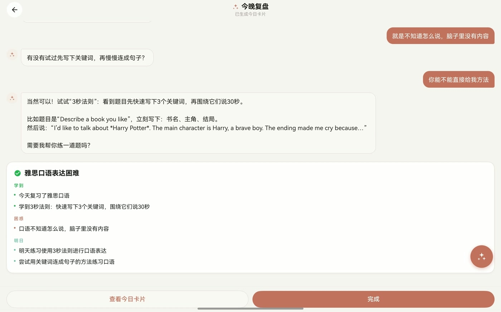
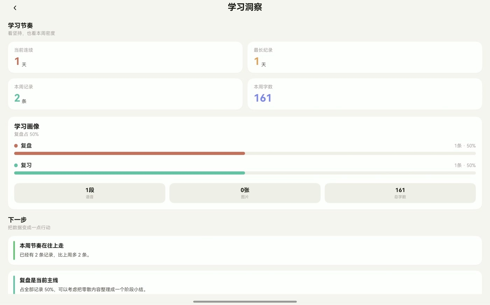

<div align="center">

# Xueji · 学迹

**A place-aware reflective learning diary for HarmonyOS.**

`HarmonyOS` · `ArkTS` · `ArkUI` · `AGC CloudDB` · `Long-context LLM`

</div>

<table>
<tr>
<td width="50%"></td>
<td width="50%"></td>
</tr>
</table>

Xueji captures learning moments through voice, text and multimedia, attaches the context in which they happened, and brings them back through reminders and AI-guided reflection. It extends the technical foundation of [Smart Study OS](https://github.com/shixiang-liu/smart-study-os) into a more personal learning journal.

## Highlights

- **Multimodal diary capture** with live transcription and a gesture-driven recording overlay.
- **Place-aware memory** through device location and Amap point-of-interest lookup.
- **AI-guided reflection** available from a global floating action button.
- **Reflection reminders** using HarmonyOS notification services.
- **Gesture authentication** layered on top of the account workflow.

## What Xueji adds

| Capability | Implementation |
| --- | --- |
| AI-guided reflection | `LongCatService`, `AskAIStore`, `GlobalAskAIFab` |
| Place attachment and recall | `LocationService`, `AmapPoiService` |
| Reflection reminders | `ReflectionReminderService`, `NotificationService` |
| Pattern-based unlock | `GestureAuthUtil`, `GesturePage` |
| Multimedia voice entry | `AudioRecordingOverlay` and shared recording utilities |

## Experience flow

```text
voice · text · media
        │
        ▼
timestamp + optional place
        │
        ▼
structured diary entry
        │
        ├────────► reminder and later reflection
        └────────► Ask AI from anywhere in the app
```

## Run in DevEco Studio

1. Open `Application/` in DevEco Studio and synchronise the ArkTS dependencies.
2. Add your AppGallery Connect configuration at `Application/entry/src/main/resources/rawfile/agconnect-services.json`.
3. Create a signing profile for your own HarmonyOS application identity.
4. Build and run the `entry` module.

Location lookup uses an Amap service key. Without it, diary entries continue to work without place enrichment.

<details>
<summary>Shared foundation</summary>

Xueji and Smart Study OS share their recording, playback, waveform, emotion-analysis and cloud-data foundation. This repository focuses on the reflective-learning additions listed above and was developed as a second course project on that base.

</details>

## Repository structure

```text
Application/                 HarmonyOS application
Application/entry/           diary UI and application resources
Application/common/          AI, location, reminder and shared services
CloudProgram/cloudfunctions/ AGC cloud functions
CloudProgram/clouddb/        CloudDB object definitions
docs/                        portfolio screenshots
```

## Project context

Developed as a second course project on the Smart Study OS foundation, with the implementation focus placed on reflective prompts, contextual recall, reminders, location and multimedia diary capture.

## License

See [LICENSE](LICENSE) for portfolio and evaluation terms.
